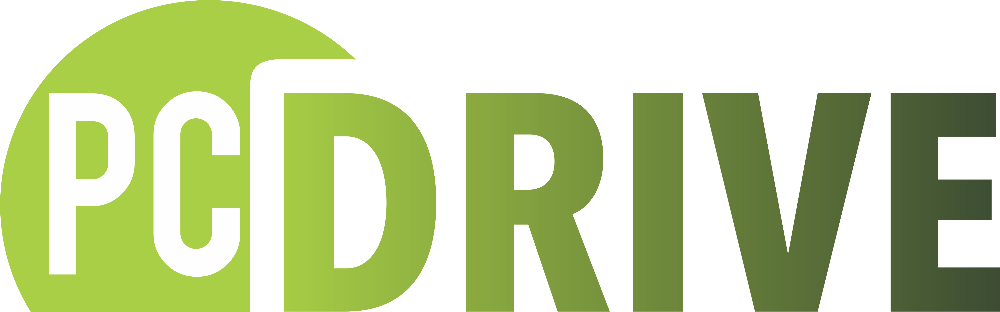

# Projeto Final - {reprograma}

<Logotipo com o nome pcdrive com fundo branco e letras de cor verde e sombreamento escuro>

-----------------------
O projeto PCDrive foi criado visando ajudar pessoas com deficiência que procuram oportunidades de emprego, diante da grande dificuldade motivada pela falta de programas de inclusão e o pouco conhecimento das empresas em saber como encontrar e recrutar candidates com deficiência.

Segundo a pesquisa da Santo Caos em parceria com a Catho realizada em 2019 (com mais de 1.000 respondentes), 34% dos profissionais com deficiência se sentem isolados no ambiente de trabalho, percepção que reforça a lacuna de investimento das empresas a respeito do tema. Outros pilares também foram observados, tais como ausência de: compartilhamento (37%), compromisso (17%) e orgulho (11%). 

A API irá armazenar dados importantes de candidatxs, suficiente para suprir as informações necessárias para uma empresa se interessar e contactar para participar de um processo seletivo. Também irá armazenar dados das empresas cadastradas e que querem divulgar seu interesse em investir na diversidade.

Será utilizado duas schemas:

| CANDIDATE     | EMPRESAS       |
| ------------- | -------------- |
| id            |  id            |
| name          |  companyName   |
| birth         |  fantasyName   |
| genre         |  cnpj          |
| deficiency    |  occupationArea|
| breed         |  city          |
| city          |  phone         | 
| schooling     |  email         |
| language      |  userName      |
| experience    |      -         |
| area          |      -         |
| phone         |      -         |
| email         |      -         |
| status        |      -         |        

 #### Tecnologias utilizadas
- Node.js
- MongoDB
- Git
- Heroku
- Postman

#### Pacotes utilizados

- package.jason 
- node_modules

#### Métodos e Rotas

Por meio dos métodos HTTP, será manipulado os dados de acordo com a necessidade dos usuários.

==> No usuário Candidates (candidat@), os métodos e rotas serão:

| MÉTODO |     ROTA         |             AÇÃO              |
|------- | ------------     | ------------------------------|
|GET     | getAllCandidates |   EXIBIR TODOS OS CANDIDATOS  |
|GET     | getCandidate     |   EXIBIR CANDIDATO POR ID     |
|GET     | getPorArea       |   EXIBIR POR AREA DE EXPERIÊNCIA|
|GET     | getExperience    |   EXIBIR CANDIDATOS EXPERIENTES|
|POST    | createCandidate  |   CADASTRAR CANDIDATO         |
|DELETE  | deleteCandidate  |   EXCLUIR CANDIDATO           |
|PUT     | updateCandidate  |   ATUALIZAR DADOS             |

==> No usuário Companies (empresas), os métodos e rotas serão:

| MÉTODO |     ROTA         |             AÇÃO              |
|------- | ------------     | ------------------------------|
|GET     | getAllCompanies  |   EXIBIR TODAS AS EMPRESAS    |
|GET     | getCompany       |   EXIBIR EMPRESAS  POR ID     |
|GET     | getCity          |   EXIBIR POR CIDADE           |
|POST    | createCompany    |   CADASTRAR EMPRESA           | 
|DELETE  | deleteCompany    |   EXCLUIR EMPRESAS            |
|PUT     | updateCompany    |   ATUALIZAR DADOS             |

Autora: Tereza Oliveira

fonte:https://www.catho.com.br/carreira-sucesso/colunistas/noticias/obstaculos-da-inclusao-pcd-no-mercado-de-trabalho/

#### readme em processo de finalização